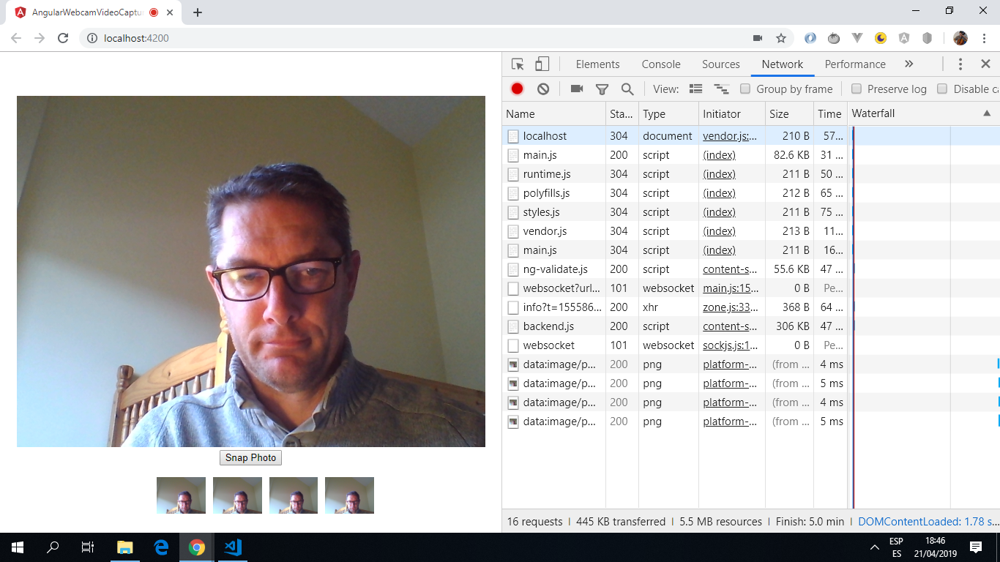

# :zap: Angular Webcam Video Capture

* Displays webcam video stream and captures images from local PC web browser. Photos can be captured using a button that will save the images in an array. Works in Chrome only.

*** Note: to open web links in a new window use: _ctrl+click on link_**

## :page_facing_up: Table of contents

* [General info](#general-info)
* [Screenshots](#screenshots)
* [Technologies](#technologies)
* [Setup](#setup)
* [Features](#features)
* [Status](#status)
* [Inspiration](#inspiration)
* [Contact](#contact)

## :books: General info

* The captured pictures are added to a 'captures' array. This is cleared each time after the app initialises as part of the ngOnInit lifecycle hook.
* The `srcObject` property of the HTMLMediaElement interface is now used to get webcam video stream due to [deprecation of "createObjectURL"](https://developer.mozilla.org/en-US/docs/Web/API/HTMLMediaElement/srcObject).

## :camera: Screenshots

.

## :signal_strength: Technologies

* [Angular v8](https://angular.io/)
* [Angular CLI v8](https://cli.angular.io/).
* [Angular ElementRefs](https://angular.io/api/core/ElementRef#description) used as a wrapper inside of a View. Security issues with this method and it means service workers cannot be used. Better to use templating and databinding or use Renderer2.
* [Angular ViewChild](https://angular.io/api/core/ViewChild) decorator used to configure a view query.
* [navigator.mediaDevices.getUserMedia()](https://developer.mozilla.org/en-US/docs/Web/API/MediaDevices/getUserMedia) method used to prompts the user for permission to use a media input which produces a MediaStream. It returns a Promise that resolves to a MediaStream object (assuming permission is given). A catch function was added to alert the user to any errors.

## :floppy_disk: Setup

* Run `ng serve` for a dev server. Navigate to `http://localhost:4200/`. The app will automatically reload if you change any of the source files.

## :computer: Code Examples

* Extract from `app.component.ts` showing deprecated `createObjectURL` code and working replacement code.

```typescript

    public ngAfterViewInit() {
        if(navigator.mediaDevices && navigator.mediaDevices.getUserMedia) {
            navigator.mediaDevices.getUserMedia({ video: true }).then(stream => {
                // this.video.nativeElement.src = window.URL.createObjectURL(stream);
                this.video.nativeElement.srcObject = stream;
                this.video.nativeElement.play();
            });
        }
    }


```

## :cool: Features

* Works with [Google Chrome Version 73.0.3683.103 Official Build 64 bits](https://www.google.com/chrome/).
* Updated to latest Angular 8 version with all dependency conflicts resolved.

## :clipboard: Status & To-Do List

* Status: Working.
* To-Do: add an improved UI. Add database connection to store captured photos.

## :clap: Inspiration

* [Nic Raboy of X-Team blog: CAPTURE WEBCAM IMAGES FROM A BROWSER WITH ANGULAR](https://x-team.com/blog/webcam-image-capture-angular/)]
* [Matt McAlister: Get You Some Media With getUserMedia()](https://medium.com/@matt.mcalister93/get-you-some-media-with-getusermedia-726cde161cd7)

## :envelope: Contact

* Repo created by [ABateman](https://www.andrewbateman.org) - you are welcome to [send me a message](https://andrewbateman.org/contact)
